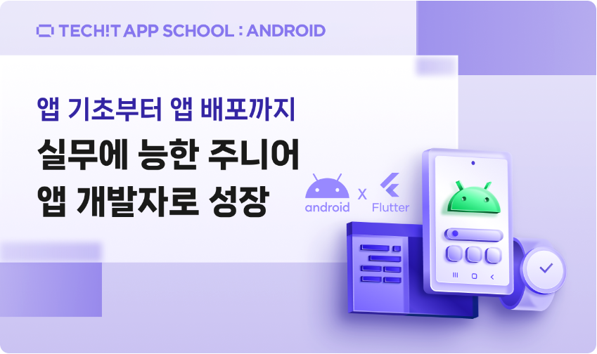

# Techit-App-School

--------------------------

이 레포지토리는 **Techit 앱 스쿨 Android 2기**를 진행하면서 Kotlin 공부한 내용을 담아두는 레포지토리입니다. 

 

이 내용은 **Techit 멋쟁이사자처럼**과 **소프트캠퍼스**에서 공부하고 있음을 알립니다!

### 개념 설명
1. Kotlin 시작 - Kotlin01_Hello
2. 주석 처리 설명 - Kotlin02_Comment
3. 표준 출력 - Kotlin03_Print
4. 세미 콜론 설명 - Kotlin04_SemiColon
5. 리터럴 설명 - Kotlin05_Literal
6. 자료형 설명 - Kotlin06_DataType
7. 변수 설명 - Kotlin07_Variable
8. 함수 설명 - Koltin08_Function

### 예제 설명
1. Example01 - 키보드로부터 입력 받아 출력하는 프로그램
2. Example02 - 키보드로부터 입력 받아 홀수, 짝수를 판별하는 프로그램
3. Example03 - 키보드로부터 주민등록번호를 입력받아 처음 두자리는 생년, 세네번째 자리는 생월, 다섯여섯번째 자리는 생일, 일곱번째 숫자는 태어난 연도와 성별을 구분할 수 있는 숫자로 인식하여 개인 정보를 파악할 수 있는 프로그램.